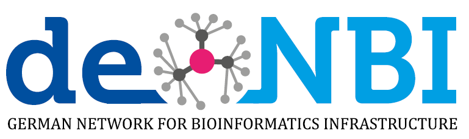
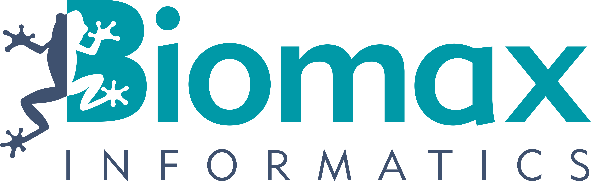
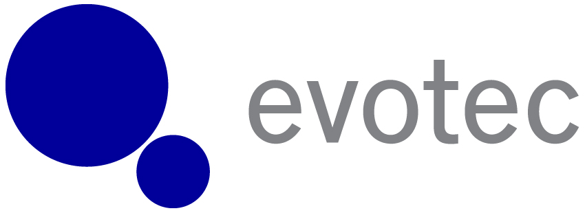

 

# European Bioconductor Meeting 2018

The 2018 edition of the **European Bioconductor Meeting** will be
hosted at the Technical University of Munich, Germany, on 6-7 December 2018.

- Where: [TUM-IAS Building](https://www.ias.tum.de/index.php?id=32), Lichtenbergstrasse 2a, Garching
- When: 6 - 7 December 2018

## Introduction
The meeting is aimed at biologists, bioinformaticians, statisticians, programmers and software engineers who use or contribute to the [Bioconductor project](https://www.bioconductor.org/), or are interested in using Bioconductor. The goals are to:

- foster the exchange of technical expertise
- keep contributors up to speed with the latest developments
coordinate any related efforts.

The main conference will be on Thursday 6 and Friday 7 December 2018. The day before, attendees are welcome to join the [STRATOS](http://stratos-initiative.org) topic group 9 "high-dimensional data" for a keynote talk by [Lisa Meier McShane](https://brb.nci.nih.gov/aboutBRP/lmcshane.htm).

## Key dates 
- Oct 17: Abstract deadline
- Oct 29: Notice of acceptance
- Nov 21: Registration deadline
- Dec 5 (evening): STRATOS meeting
- Dec 6-7: European Bioconductor Meeting

## Registration

Registration is now closed.

## Confirmed invited speakers
- [Keegan Korthauer](http://kkorthauer.org), Dana-Farber Cancer Institute and Harvard T.H. Chan School of Public Health
- [Fanny Perraudeau](https://www.wholebiome.com/team.html#fanny-perraudeau), Whole Biome, San Francisco
- [Bernd Bischl](https://www.compstat.statistik.uni-muenchen.de/people/bischl/), LMU, Munich

## Preliminary schedule
**Joint meeting with the [STRATOS](http://stratos-initiative.org) topic group 9 "high-dimensional data"**
 
| Wed 5 Dec     | [Schellingstr. 3](https://goo.gl/maps/zZ2NDx6zKYm) (Munich centre, near Geschwister-Scholl-Platz), [lecture hall S005](https://i12g-gagneurweb.in.tum.de/project/EuroBioc2018/MapSchellingstrasse3STRATOSTalk.pdf)|
|---------------|---------------------------------------------------|
| 17:00 - 18:00 | [Lisa Meier McShane](https://brb.nci.nih.gov/aboutBRP/lmcshane.htm) Reproducibility of omics research: shared responsibilities and consequences of ignorance  | 
| 18:00 - 19:00 | Introduction to the [STRATOS initiative](http://stratos-initiative.org)         |
| 19:00 -       | Informal get-together in some brewery|

**EuroBioc 2018**
 
| Thu 6 Dec     |[TUM-IAS Building](https://www.ias.tum.de/index.php?id=32), Lichtenbergstrasse 2a, Garching  |                                   
|---------------|---------------------------------------------------|
| 09:00 - 09:15 | **Registration**                      |
| 09:15 - 09:30 | Welcome and introduction          |
| 09:30 - 10:00 | [Bernd Bischl](https://www.compstat.statistik.uni-muenchen.de/people/bischl/): mlr3: Towards an object-oriented, configurable ML pipeline system in R6     |
| 10:00 - 10:30 | **Session I**                     |
| 10:00 - 10:15 | Lukas Weber: HDCytoData package: High-dimensional cytometry benchmark datasets in Bioconductor formats                     |
| 10:15 - 10:30 | Elena Landoni: Normalization and batch correction effects on class comparison analysis with high throughput data: a simulation study   |
| 10:30 - 11:00 | Coffee break                      |
| 11:00 - 12:15 | **Session II - Visualization**                        |
| 11:00 - 11:15 | Nemanja Vucic: Using R/Shiny implementation of Bioconductor packages on the Cancer Genomic Cloud platform         |
| 11:15 - 11:30 | Federico Marini: iSEE: data exploration made easy & reproducible                        |
| 11:30 - 11:45 | Svetlana Ovchinnikova: R/LinkedCharts: A novel approach for simple but powerful interactive data analysis         |
| 11:45 - 12:00 | Laurent Gatto / Lisa Breckels: Interactive visualisation of spatial proteomics data            |
| 12:00 - 12:15 | Phil Cheng: TCGA Browser  |
| 12:15 - 13:30 | Lunch                             |
| 13:30 - 14:00 | [Martin Morgan](https://www.roswellpark.org/martin-morgan) Update from the Bioconductor core team |
| 14:00 - 15:00 | **Session III - Epigenomics**                       |
| 14:00 - 14:15 | Shijie Zheng: Identification of differentially methylated cell-types in Epigenome-Wide Association Studies         |
| 14:15 - 14:30 | Jonas Ibn-Salem: sevenC: Computational Chromosome Conformation Capture by Correlation of ChIP-seq at CTCF motifs                 |
| 14:30 - 14:45 | Markus List: Analysing large-scale epigenomic data with DeepBlue        |
| 14:45 - 15:00 | Yadollah Shahryary Dizaji	MethylStar: An efficient and flexible pipeline for population-level analysis of Whole Genome Bisulfite Sequencing (WGBS) data    |
| 15:00 - 15:15 | Alexander Gosdschan: methylKit, a package for DNA methylation analysis from high-throughput bisulfite sequencing data            |
| 15:15 - 15:45 | Coffee break                      |
| 15:45 - 17:00 | **Session IV - Proteomics**                       |
| 15:45 - 16:00 | Christian Panse:	rawDiag: access orbitrap data on the fast lane        |
| 16:00 - 16:15 | Nils Kurzawa:	TPP: a Bioconductor package for analysis of thermal proteome profiling experiments                  |
| 16:15 - 16:30 | Markus Gruber:	MS-EmpiRe - Mass Spectrometry analysis using Empirical and Replicate based statistics         |
| 16:30 - 16:45 | Helena Crowell:	Differential discovery in CyTOF data with CATALYST & diffcyt            |
| 16:45 - 17:00 | Constantin Ahlmann-Eltze:	Empirical Bayesian Modeling for Mass Spectrometry Data  |
| 18:00 - 19:00 | Christmas market                  |
| 19:30 -       | Dinner at Hofbrauhaus (self-funded) |

| Fri 7 Dec     |[TUM-IAS Building](https://www.ias.tum.de/index.php?id=32), Lichtenbergstrasse 2a, Garching|
|---------------|---------------------------------------------------|
| 09:00 - 09:30 | [Keegan Korthauer](http://kkorthauer.org) Practical recommendations for controlling false discoveries in computational biology              |
| 09:30 - 10:15 | **Session V**                       |
| 09:30 - 09:45 | Ruizhu Huang:	The tree aggregation   |
| 09:45 - 10:00 | Thomas Girke:	signatureSearch: Gene Expression Signature Search Methods for Discovering Novel Modes of Action of Drugs and Other Cellular Perturbations   |
| 10:00 - 10:15 | Ludwig Geistlinger :	Towards a gold standard for benchmarking gene set enrichment analysis   |
| 10:15 - 10:45 | Coffee break                    |
| 10:45 - 12:00 | **Session VI - Multiomics**    |
| 10:45 - 11:00 | Vince Carey:	Hybrid data architectures for multiomic experiments    |
| 11:00 - 11:15 | Johannes Rainer:	ensembldb: coordinate mapping between the genome, exome, transcriptome and proteome         |
| 11:15 - 11:30 | Laurent Gatto:	A Grammar of Omics Data Manipulation                        |
| 11:30 - 11:45 | Leo Lahti:	A roadmap for microbiome bioinformatics in R         |
| 11:45 - 12:00 | Katarzyna Wreczycka:	Genomation: a toolkit to summarize, annotate and visualize genomic intervals            |
| 12:00 - 13:30 | Lunch                           |
| 13:30 - 14:00 | [Fanny Perraudeau](https://www.wholebiome.com/team.html#fanny-perraudeau) Unlocking RNA-seq tools for zero-inflation and single cell applications using ZINB-WaVE observation weights|
| 14:00 - 15:30 | **Session VII - RNA**           |
| 14:00 - 14:15 | Clara Benoit-Pilven:	kissDE retrieves condition-specific variants in RNA-Seq data from model and non-model species         |
| 14:15 - 14:30 | Charlotte Soneson:	A junction coverage compatibility score to quantify the reliability of transcript abundance estimates and annotation catalogs   |
| 14:30 - 14:45 | Christian Mertes:	OUTRIDER: A statistical method for detecting aberrantly expressed genes in RNA sequencing data        |
| 14:45 - 15:00 | Svetozar Nesic:	Targeted synthetic datasets to benchmark allele specific expression algorithms            |
| 15:00 - 15:15 | Marijke Van Moerbeke:	A Random Effects Model for the Identification of Differential Splicing (REIDS) Using Exon and HTA Arrays                      |
| 15:15 - 15:30 | Ziga Avsec: Kipoi: accelerating the community exchange and reuse of predictive models for genomics    |
| 15:30 - 15:35 | **Wrap-up and closing**             |

## Accommodation
- [Motel One Munich-Sendlinger Tor](https://www.motel-one.com/en/hotels/munich/hotel-munich-sendlinger-tor/). This is located in the city centre close to the Sendlinger Tor underground station.
- [Motel One Munich-Garching](https://www.motel-one.com/en/hotels/munich/hotel-munich-garching/). This is located outside the city centre but closer to the conference venue. The Garching-Hochbruck station is right outside the hotel.

## Getting to the venue

By public transport (U-Bahn), the venue can be reached in approximately 30 minutes from the city centre. You need to get off at the last stop of the U6 Line (Garching-Forschungszentrum).

More information is available here

- [Ticket prices](https://www.mvv-muenchen.de/en/tickets-and-fares/tickets-daytickets/single-day-ticket/index.html). Garching-Forschungzentrum is on the green zone therefore you will need to buy the Munich XXL ticket (8,90 EUR for a single-day ticket).
- [Map of the transportation network](https://www.mvv-muenchen.de/en/maps-stations/maps/index.html)
- [Map of the ticket zones](https://www.mvv-muenchen.de/fileadmin/mediapool/03-Plaene_Bahnhoefe/Tarifplaene/Sondertarifplaene_Messe/TARIFPLAN_Schnellbahnnetz_2018_Raeume.PDF)

## Social Activities

Wed. 5 Dec. evening. There will be a talk by [Lisa McShane](https://brb.nci.nih.gov/aboutBRP/lmcshane.htm) at Ludwig-Maximilians University (LMU) from 5-6pm, followed by a presentation of the [STRATOS](http://www.stratos-initiative.org) initiative. This is an opportunity for the two groups to meet. We plan to go for some beer and food downtown afterward (self-funded).

Thur. 6 Dec. evening we will visit the Christmas market in the city centre and have a dinner party (self-funded) at the brewery [Hofbrauhaus](https://www.hofbraeuhaus.de/en/) afterwards.

Sat. 8 Dec. If the snow condition allows it, some organizers will go skiing in Garmisch, a ski resort near Munich. Everyone is welcome to join. Here some information from last year about a [train & ski-pass offer](https://www.bahn.de/p/view/mdb/bahnintern/angebotsberatung/regio/laender-tickets/pdfs/2017/mdb_260597_garmischer_ski_ticket_2017_18_flyer.pdf). 

## Code of conduct

Bioconductor is built on the free and open exchange of scientific
ideas, and the contributions of our diverse user community. In this
spirit, EuroBioc 2018 is dedicated to providing a harassment-free
conference experience for everyone. Harassment of any form (verbal,
physical, sexual, or other) will not be tolerated in talks, workshops, social activities, or online.

Reach out to conference organizers (bioceuro18@in.tum.de) or our on-site response team with any concern (Anne-Laure Boulesteix or Julien Gagneur).

## Previous meetings

If you have not previously attended any European Bioconductor meetings, you can get an idea about the topics and talks by looking at
the programmes from the
[2017](https://bioconductor.github.io/EuroBioc2017/), and
[2015](https://sites.google.com/site/eurobioc2015/) editions.

## Organising committee
- [Wolfgang Huber](https://www.embl.de/research/units/genome_biology/huber/), European Microbiology Laboratory (EMBL), Heidelberg
- [Martin Morgan](https://www.roswellpark.org/martin-morgan), Roswell Park Comprehensive Cancer Center, Buffalo
- [Mark Robinson](https://robinsonlabuzh.github.io/), University of Zurich
- [Julien Gagneur](https://www.gagneurlab.in.tum.de/), Technical University of Munich 
- [Anne-Laure Boulesteix](https://www.ibe.med.uni-muenchen.de/lehrstuehle/pr-molecular-medicine/index.html), Ludwig-Maximilians Universitaet, Munich
- [Fabian Theis](https://www.helmholtz-muenchen.de/icb/index.html), Helmholtz Zentrum Munich

## Sponsors

## Sponsor opportunities
Interested in sponsoring this conference? Please contact bioceuro18@in.tum.de.

* Gold: Up to 4 free registrations. Present a talk about R&D in your company (relevant to the bioconductor community but not necessarily based on bioconductor). 1 poster in the foyer. Recognition in promotional and scheduling material. Sponsored food or social event (e.g. Coffee break, Dinner, etc.). 2,500 Eur

* Silver: Up to 2 free registrations. Recognition in promotional and scheduling material. 1,000 Eur

## Contact
More information? Contact us at bioceuro18@in.tum.de

